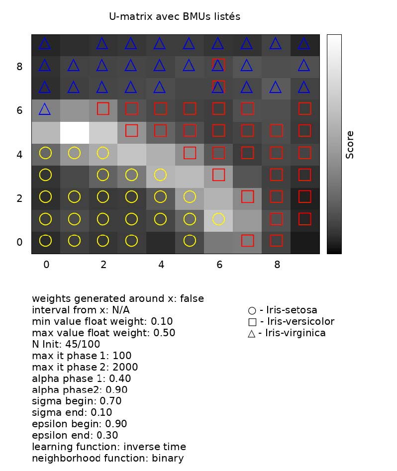
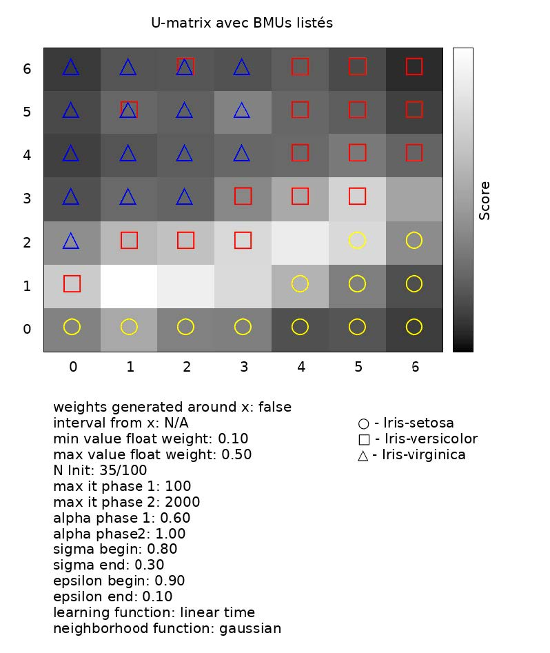
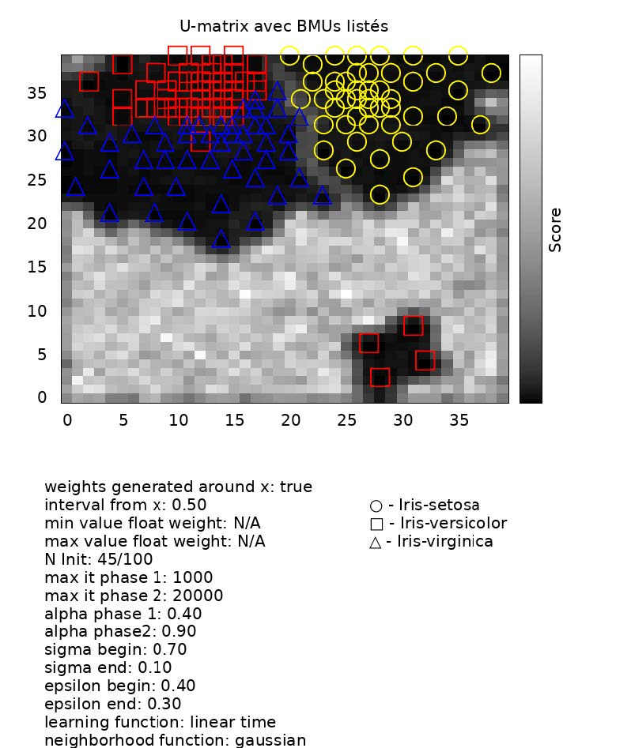
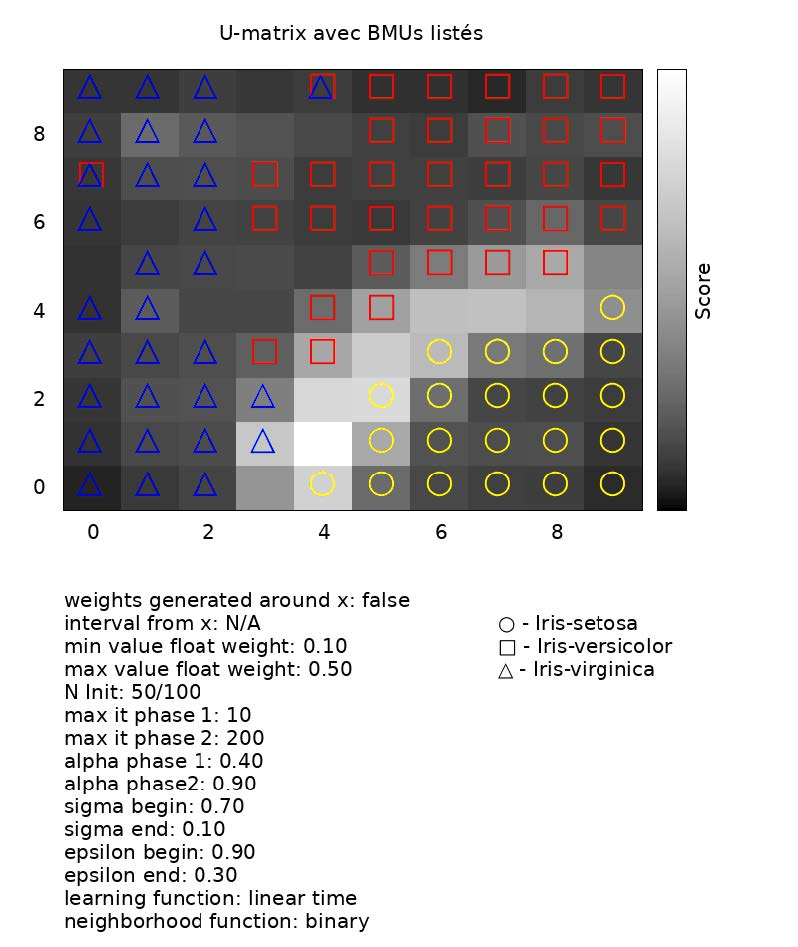
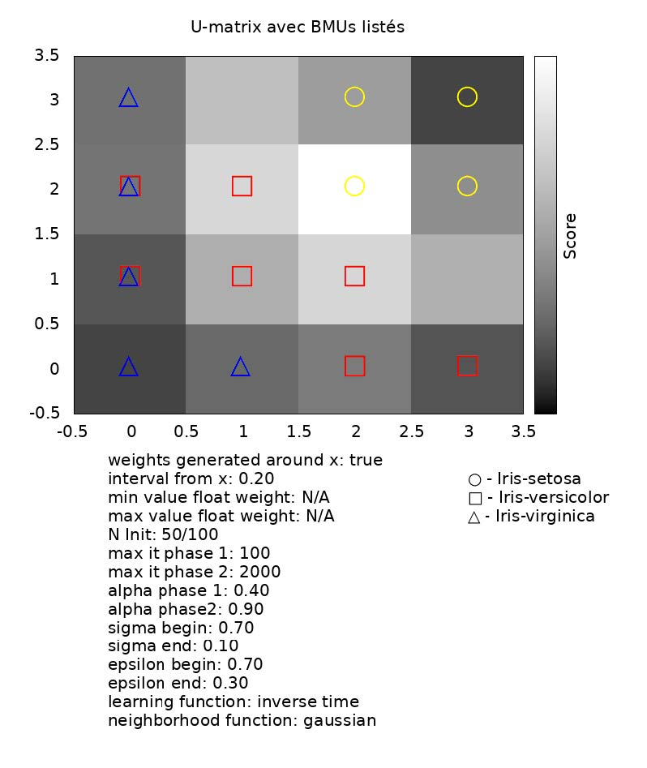
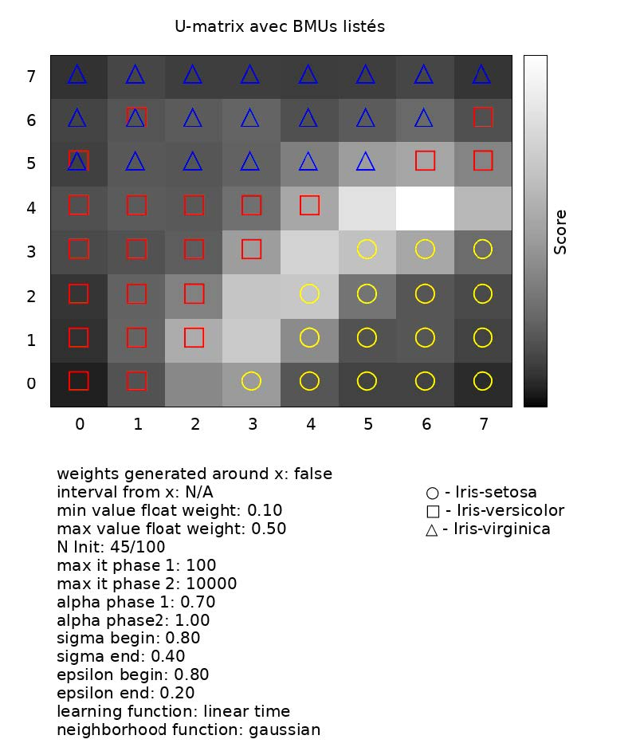
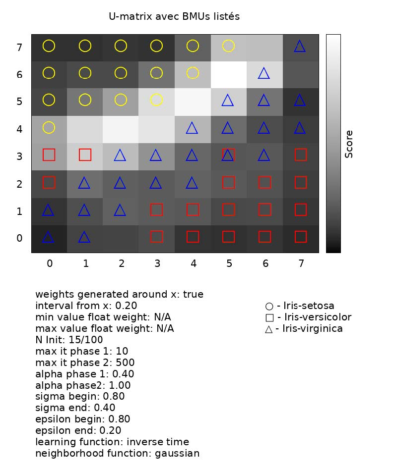

## SOM_C

Implementation of the SOM algorithm in C with a part dedicated to visualization thanks to gnuplot.

The program is fully configurable and easily allows to change the parameters via macros to test
different implementations. You can do so by changing different constants, different input files or the size of the lattice. 
The size of vectors for each attractor is dynamically generated and depends on the size of the input vectors. The program
generates a U-Matrix map which, through adding the Euclidean distances in the vicinity of an attractor
activated, allows you to view the different clusters on the map. On this map, we can also see the activated attractors
by class. I was very much inspired by the minisom outputs
(https://github.com/JustGlowing/minisom/blob/master/examples/BasicUsage.ipynb) for the visualization part.

The program can only be configured at compile time instead of taking the parameters from the command line.
In addition, the data must contain a labeled class for each input vector. The parsing of the inputs
is unforgiving: you need a very rigid csv. Moreover, to get an output, the program also requires that each entry vector
be labelized with a class name. A visualization of the map without classes, just to observe the topology and
the clusters, could/should have been possible. There is also some statically allocated memory when generating gnuplot parameters,
which takes up a lot of memory space just to ensure that one can generate large maps without being limited by a
buffer that is too small. It could/should have been done dynamically. We also do not keep the vector norm nor
a copy of the non-normalized vectors. It wouldn't be too complicated to implement but I haven't seen the
need to do it here. Finally, the map is orthogonal and does not offer the possibility of being hexagonal.

## Getting started
There are two dependencies required to run the program on linux and probably on any POSIX implementation. 
You need cmake and gnuplot. In addition, in order to print special symbols (triangle, square, round) on the
maps generated by gnuplot, I used Arial Unicode MS. If you have problems displaying these
characters, check that this font is correctly installed.

### Install
```sh
$ sudo apt-get update
$ sudo apt-get install cmake
$ sudo apt-get install gnuplot
$ cmake CMakeLists.txt 
```

### Usage Example
To achieve each of the outputs shown here, the parameters are modified via the
macros indicated in the legend. I have to compile every time I change the
parameters, then I call the program called SOM_C, with:

```sh
$ make
$ ./SOM_C
```

In order to debug, the program also prints the data
passed to gnuplot to the console.


#### Config in main.c
```C
/* Tous les paramètres adjustables qui ont une influence sur
l'algorithme sont des constantes
gérés par le pré-processeur. */
#define DATA_FILE "./data/iris.data"
#define NBR_ROWS 7
#define NBR_COLUMNS 7
#define WEIGHTS_GENERATED_AROUND_X false /* Si true alors ni
MIN_VALUE_FLOAT_WEIGHT ni MIN_VALUE_FLOAT_WEIGHT ne
seront utilisés.
L'opposé est vrai pour INTERVAL_FROM_X. */
#define INTERVAL_FROM_X 0.5
Solal Gaillard - L3 Informatique
13406890
Programmation pour l'Intelligence Artificielle – Série 3
2
#define MIN_VALUE_FLOAT_WEIGHT 0.1
#define MAX_VALUE_FLOAT_WEIGHT 0.5
#define N_INIT 35 /* Exprimé ici en pourcentage. */
#define MAX_IT_PHASE_1 100 /* Nombre d'itérations lors de
l'apprentisage phase 1. */
#define MAX_IT_PHASE_2 2000 /* 10 à 100 fois plus que
MAX_IT_PHASE_1 dépendant d'ALPHA_PHASE_1. */
#define ALPHA_PHASE_1 .6 /* Taux d'apprentissage. */
#define ALPHA_PHASE_2 1.0
#define SIGMA_BEGIN .8
#define SIGMA_END .3
#define EPSILON_BEGIN .9
#define EPSILON_END .1
#define LEARNING_FUNC linear /* choix entre linear et inverse. */
#define NEIGHBORHOOD_FUNC gaussian /* choix entre gaussian et
binary. */
#define U_MATRIX_FILE_EXPORT "SOM-IRIS-U-MATRIX.png"
```


## How and Why
I tried to implement the SOM algorithm in the cleanliest way
possible while providing visualization thanks to
gnuplot. To test the algorithm, I used the iris "dataset" accessible on
https://archive.ics.uci.edu/ml/datasets/iris. I also relied on the data formatting in this data file
as the basis for the processing of any other file. Thus, the program can only "parse" files formatted identically
(no spaces following the "comma" delimiter and no lines
empty). The only flexibility is that the data vectors in the input file
are not limited to 4 dimensions. The algorithm works well and I am quite proud of the
result. The program modifies the matrices by reference, always initialized empty.
The matrix which represents the attractors has its size defined at compilation (it is not
not the case for the vectors found for each attractor which
depend on the input data). Obviously, the program could be more
flexible and generate all matrices dynamically. The easiest way to cope with paramaterization was to
put all the parameters in macros and therefore generate them at compile time (each compilation provides 
different implementations of SOM with different parameters). You will find all the macros that
allow you to define all the parameters of the algorithm at the top of the program in
main.c.

## Examples Outputs








We can see that whatever the parameters used, the trends stay the same. We always
clusterize the three classes of irises with a fairly limited overlap between versicolor and
virginica.


## References that have helped me:
Below is a list of references that have helped me. I used
minisom in order to check the behavior of this program by comparing it to
the python implementation. The visualization is largely taken from the examples
provided by the minisom documentation. Moreover, I had to read extensively the
gnuplot documentation.

- https://github.com/JustGlowing/minisom
- https://heartbeat.fritz.ai/introduction-to-self-organizingmaps-soms-98e88b568f5d
- https://dzone.com/articles/self-organizing-maps
- https://towardsdatascience.com/self-organizing-mapsff5853a118d4
- http://gnuplot.sourceforge.net/demo/heatmaps.html
- http://www.ai-junkie.com/ann/som/som3.html